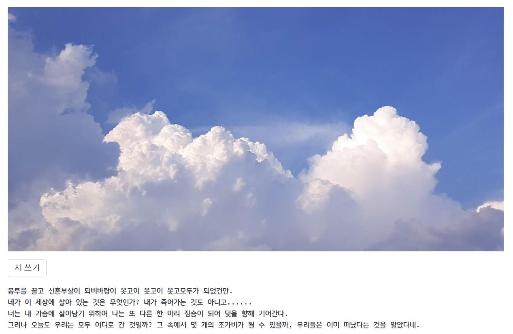

<div align="center">


</div>  

# ✍️Korean Poem Generation
***
## Project Summary

사진으로만 남은 추억을 시로 간직해보는 건 어떨까요?  

'AI 시인 김삿갓'은 한국어 Image to poem 프로젝트입니다. 추억이 담긴 사진을 넣어주면 그에 맞는 한글 시를 써드립니다.  

참고할만한 논문들을 찾아봤지만 image to english poem과 관련된 논문들만 있을 뿐, image to korean poem task를 진행했다는 논문이나 프로젝트는 찾아볼 수 없었습니다. 본 프로젝트는 성능 좋은 large model들을 활용해서 한글 시를 생성합니다.  

한국어 image to poem이 영어 poem 생성보다 어려운 이유 중 하나는 마땅한 시 데이터 셋이 없다는 것입니다. 따라서 한국어 시 데이터 셋을 직접 구축하고, 이를 활용해서 GPT 기반 텍스트 생성 모델을 fine-tuning했습니다.  
***
## Contributors🔥
| [김서진](https://github.com/seandoprep) | [김성준](https://github.com/Stellena) | [김형준](https://github.com/hyjun2352) | [이승재](https://github.com/Tim3s) | [이정은](https://github.com/ljeadec31) | [최명헌](https://github.com/MyeongheonChoi) |
| :-: | :-: | :-: | :-: | :-: | :-: |
|  |  |  |  |  |  
| **데이터 수집, KoGPT2** | **데이터 전처리 및 후처리** | **데이터 전처리 및 후처리** | **ClipCap** | **ClipCap** | **KoCLIP, 웹 Streamlit** |
***
## Architecture Flow Map
***
## Model
***
## Folder Structure 📂
```
├── 📄README.md
├── 📄requirements.txt
├── 📄YAICON_POEM.py
├── 📄poem_preprocess.ipynb
├── 📂data
│   └── 📂poem_data
│       └── 📄dica_poem_crawled.xlsx
│       └── 📄poem_crawled_data.xlsx
│       └── 📄annotation_one_caption_dict.json
│       └── 📄annotation_captions_dict.json.zip
├── 📂
```
***
## Reference
- [시 사랑 데이터](http://www.poemlove.co.kr/)
- [디카시 마니아 시, 이미지 데이터](https://cafe.daum.net/dicapoetry/1aSh)
