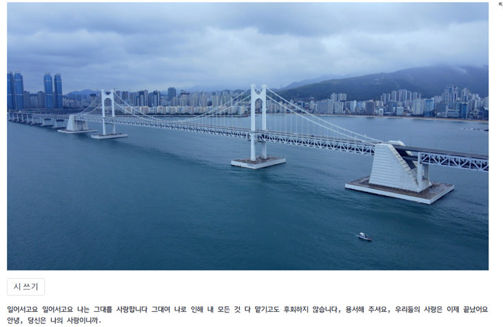

<div>


  
# ✍️Korean Poem Generation
***
## Project Summary
  

__사진으로만 남은 추억을 시로 간직해보는 건 어떨까요?__  
  
'AI 시인 김삿갓'은 한국어 Image to poem 프로젝트입니다. 추억이 담긴 사진을 넣어주면 그에 맞는 한글 시를 써드립니다.  
  
사진 내의 객체에만 집중하여 시를 생성하는 기존 방식에서 벗어나, 특정 이미지를 통해 떠올릴 수 있는 감정 및 심상들을 담은 시를 생성하는 네트워크를 구축했습니다. 
***
## Contributors🔥
| [김서진](https://github.com/seandoprep) | [김성준](https://github.com/Stellena) | [김형준](https://github.com/hyjun2352) | [이승재](https://github.com/Tim3s) | [이정은](https://github.com/ljeadec31) | [최명헌](https://github.com/MyeongheonChoi) |
| :-: | :-: | :-: | :-: | :-: | :-: |
|  |  |  |  |  |  
| **데이터 수집, KoGPT2** | **데이터 전처리 및 후처리** | **데이터 전처리 및 후처리** | **ClipCap** | **ClipCap** | **KoCLIP, 웹 Streamlit** |
***
## Architecture Flow Map


***
***
## How to use
```bash
# streamlit 으로 demo version 실행
streamlit run YAICON_POEM.py
```
```bash
# Kogpt2 finetuning
python kogpt2_base_finetune.py --repo_name {huggingface repo name} --auth_token {huggingface auth token}
```
저희가 fine-tuning한 KoGPT2 모델의 가중치는 [이곳](https://huggingface.co/sean3819/KoGPT2_poem_finetuning)에 공개되어 있습니다.
***
## Folder Structure 📂
```
├── 📄README.md
├── 📄requirements.txt
├── 📄YAICON_POEM.py 
├── 📂data
│   ├── 📄result.jpg
│   ├── 📄poem_preprocess.ipynb
│   └── 📂poem_data
├── 📂model
│   ├── 📄kogpt2_base_finetune.py
│   ├── 📄kogpt2_finetune.py
│   └── 📄model.py
```
***
## Reference
- [시 사랑 데이터](http://www.poemlove.co.kr/)
- [디카시 마니아 시, 이미지 데이터](https://cafe.daum.net/dicapoetry/1aSh)
- [Look-Attend-and-Generate-Poem](https://github.com/l-yohai/Look-Attend-and-Generate-Poem/tree/master)
```
@article{mokady2021clipcap,
  title={ClipCap: CLIP Prefix for Image Captioning},
  author={Mokady, Ron and Hertz, Amir and Bermano, Amit H},
  journal={arXiv preprint arXiv:2111.09734},
  year={2021}
}
```
